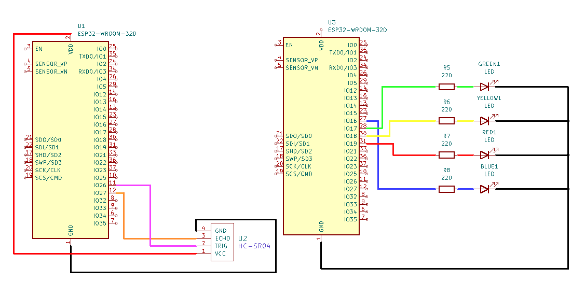
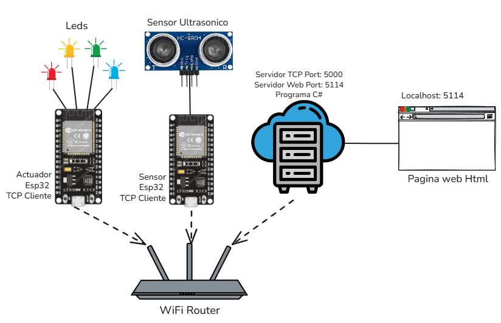
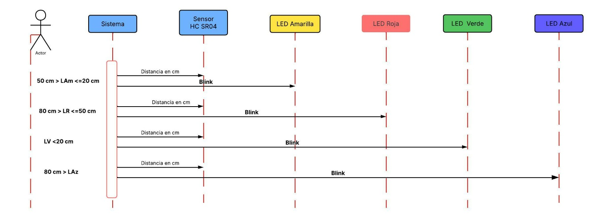
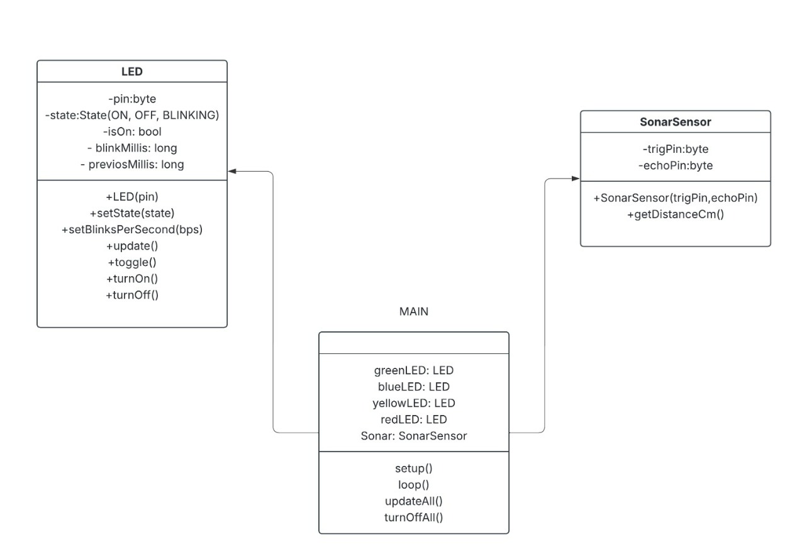
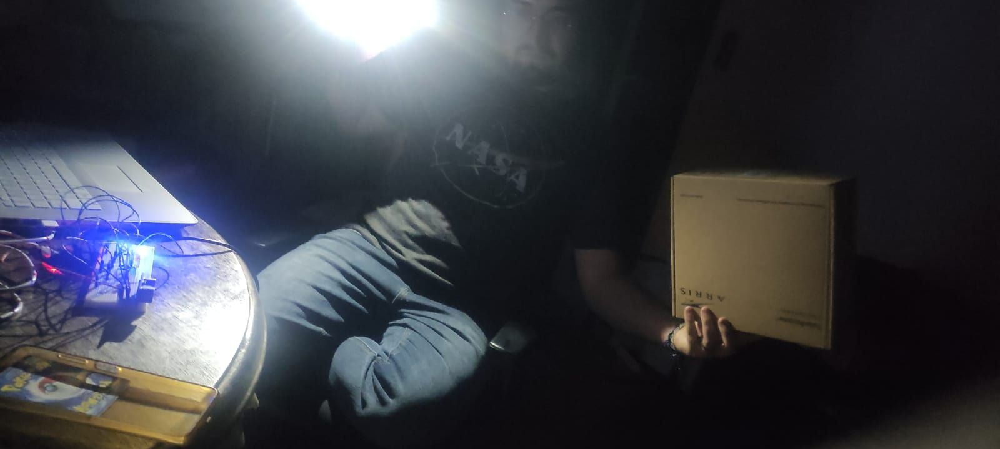

# Universidad Católica Boliviana Cochabamba
## Departamento de Ingeniería y Ciencias Exactas
## [SIS-234] Internet De Las Cosas
### Carrera de Ingeniería de Sistemas

---

# Informe sobre:
## Integración de sensores y actuadores en un objeto inteligente

### Evaluación de la Materia Internet de las Cosas

**Autores:**

- Vargas Prado Ariana Nicole  
- Zubieta Sempertegui Andres Ignacio  

---

Cochabamba - Bolivia  
Marzo 2026 

# 1. Requerimientos Funcionales y No Funcionales
## Requerimientos Funcionales

- El microcontrolador debe procesar la señal enviada por el sensor ultrasónico y convertirla en una medición de distancia expresada en centímetros.

- El sistema debe realizar mediciones de distancia de forma continua mientras el dispositivo esté encendido.

- El sistema debe clasificar la distancia detectada en diferentes rangos definidos por el sistema.

  Ejemplo de rangos:
  - Distancia menor a 40 cm  
  - Distancia entre 40 cm y 80 cm  
  - Distancia mayor o igual a 80 cm

- El sistema debe encender un LED azul en modo parpadeo cuando la distancia detectada sea mayor a 80 cm.

- El sistema debe activar un LED rojo en modo parpadeo cuando la distancia detectada este entre 80 y 50 cm.

- El sistema debe activar un LED amarillo en modo parpadeo lento cuando la distancia detectada esté entre 50 cm y 20 cm.

- El sistema debe encender un LED verde de forma constante cuando la distancia detectada sea menor a 20 cm. 

- El sistema debe apagar todos los LEDS cuando el sensor no detecte un objeto.

## Requerimientos No Funcionales

- El sistema debe reaccionar a cambios en la distancia en un tiempo menor a 1 segundo.

- El sistema debe medir la distancia con un margen de error menor al 2.5% respecto a la distancia real.

- El sistema debe tener un margen de error de precision menor al 2.5%.

- Se debe determinar que materiales se puede usar con el senson ultra sonido, su precision y su exactitud

- Se debe determinar la distancias maximas y minimas para el funcionamiento preciso y exacto del sensor.

- El sistema debe dejar que el usuario defina la cantidad de veces que parpadea por segundo, y esto debe tener un error menor al 10%

- El código debe estar dividido en funciones o módulos que permitan modificar o ampliar el sistema fácilmente.

- El sistema debe permitir modificaciones futuras como agregar nuevos actuadores o sensores.

# 2. Diseño del Sistema

## 2.1 Diagrama de circuito

## 2.2 Diagrama de arquitectura del sistema

## 2.3 Diagramas estructurales y de comportamiento
### 2.3.1 Diagrama de secuencia

### 2.3.1 Diagramas uml de clases

# 3. Implementación

## 3.1 Código fuente documentado

[Enlace a GitHub] https://github.com/Andrezubi/ProyectosESP32-IoT-Vargas-Zubieta/tree/main/Project1/main

# 4. Pruebas y Validaciones
## Prueba de exactitud de distancia

Para evaluar la exactitud del sistema se realizaron 20 mediciones a tres distancias de referencia: 80 cm, 50 cm y 20 cm utilizando el sensor ultrasónico. Con los datos obtenidos se calcularon el promedio, la desviación estándar y el porcentaje de error de precision y exactitud, con el objetivo de comparar las mediciones del sistema con las distancias reales.

Los datos utilizados en esta prueba se encuentran en la hoja:

[Exactitud de distancia](https://docs.google.com/spreadsheets/d/1DyKpLJWUTkjiDA7z87IJXlJ0ULdZPX75TzI_sI9DBeM/edit?gid=0#gid=0)

## Prueba de materiales para distancia

Para analizar el comportamiento del sensor ultrasónico frente a distintos materiales, se realizaron 10 mediciones a una distancia de referencia de 30 cm utilizando superficies como madera, plástico, vidrio, mano, plastoformo, metal y cerámica, además de una medición de control sin objeto. El objetivo fue observar cómo el tipo de material influye en la medición de distancia del sensor.

Con los datos obtenidos se calcularon el promedio, la desviación estándar y los errores de exactitud y precisión para cada material. 

Los datos utilizados en esta prueba se encuentran en la hoja:

[prueba de materiales para distancia](https://docs.google.com/spreadsheets/d/1DyKpLJWUTkjiDA7z87IJXlJ0ULdZPX75TzI_sI9DBeM/edit?gid=282925511#gid=282925511)

## Prueba de distancias mínimas y máximas del sensor

Para evaluar el rango de funcionamiento del sensor ultrasónico se realizaron mediciones en distancias cercanas al límite máximo y mínimo de detección. En el caso de las distancias máximas se tomaron mediciones entre 270 cm y 310 cm, mientras que para las distancias mínimas se realizaron pruebas entre 10 cm y 0 cm, registrando varias mediciones para cada punto.

Los datos utilizados en esta prueba se encuentran en la hoja:

[prueba de distancias minimas y maximas sensor](https://docs.google.com/spreadsheets/d/1DyKpLJWUTkjiDA7z87IJXlJ0ULdZPX75TzI_sI9DBeM/edit?gid=2038861534#gid=2038861534)
 
## Prueba parpadeo por segundo

Se realizaron pruebas para verificar la frecuencia de parpadeo de un LED configurado a diferentes valores entre 1 y 5 parpadeos por segundo (b/s). Para cada configuración se contó manualmente el número de parpadeos durante 10 segundos. El procedimiento se repitió 6 veces por cada frecuencia con el fin de obtener resultados más confiables y calcular un promedio de los valores registrados.

[Prueba parpadeo por segundo](https://docs.google.com/spreadsheets/d/1DyKpLJWUTkjiDA7z87IJXlJ0ULdZPX75TzI_sI9DBeM/edit?gid=241907707#gid=241907707)

# 5. Resultados 
## Prueba de exactitud de distancia

Los resultados obtenidos muestran que el sistema logró medir distancias cercanas a los valores reales de 80 cm, 50 cm y 20 cm. Los promedios obtenidos fueron 79.63 cm, 49.52 cm y 20.04 cm respectivamente. Además, los errores de exactitud registrados fueron 0.46%, 0.96% y 0.21%, lo que indica una alta precisión en las mediciones realizadas por el sensor ultrasónico.

## Prueba de materiales para distancia

Las pruebas realizadas con diferentes materiales a una distancia de 30 cm mostraron que la mayoría de las mediciones se mantuvieron cercanas al valor real. Sin embargo, algunos materiales como la mano y la cerámica presentaron una mayor variación en las mediciones debido a las características de reflexión de las ondas ultrasónicas. De igual forma se observo que materiales que absorben sonido como la manta no son detectadas por el sensor.

## Prueba de distancias mínimas y máximas del sensor

Durante las pruebas realizadas en los rangos de distancia máxima y mínima se observó que el sensor puede medir correctamente distancias cercanas a 270 cm, 280 cm y 290 cm, con errores de exactitud bajos. Sin embargo, al acercarse a los límites extremos del sensor, especialmente en distancias muy pequeñas o superiores a 300 cm, el sensor presenta dificultades para detectar el objeto o aumenta el error de medición.

## Prueba parpadeo por segundo

Los promedios obtenidos fueron 10.16, 20.66, 28.16, 37.66 y 45.66 parpadeos para las frecuencias configuradas de 1 a 5 b/s respectivamente. Al convertir estos valores a parpadeos por segundo se obtuvieron frecuencias aproximadas de 1.01, 2.06, 2.81, 3.76 y 4.56 b/s. Los errores de exactitud registrados se encuentran entre 1.67% y 8.67% en comparación con los valores esperados.

# 6. Conclusiones

- Los resultados obtenidos muestran que el sistema logró medir distancias cercanas a los valores reales de 80 cm, 50 cm y 20 cm. Los promedios obtenidos fueron 79.63 cm, 49.52 cm y 20.04 cm respectivamente. Además, los errores de exactitud registrados fueron 0.46%, 0.96% y 0.21%, lo que indica una alta precisión en las mediciones realizadas por el sensor ultrasónico.

- El sensor ultrasónico puede medir distancias correctamente con diferentes tipos de materiales, aunque el tipo de superficie influye en la estabilidad de la medición. Materiales con superficies irregulares o con menor capacidad de reflexión pueden generar ligeras variaciones en los resultados y podemos obsevar que directamente no funciona con ciertos materiales como telas y mantas.

- El sensor ultrasónico tiene un rango de funcionamiento efectivo limitado. Dentro de ese rango el sistema mantiene mediciones relativamente precisas, pero al superar los límites de operación la detección del objeto se vuelve inestable o inexistente. Vemos que su rango de funcionamiente esta alrededor de 3cm a 290 cm. Esto tambien puede ser dado debido a como hemos configurado el sensor, ya que hemos limitado el tiempo maximo de espera para recibir la señal de 30 milisegundos. Esto puede significar que a ciertas distancias no funcione por esto

- Los promedios obtenidos fueron 10.16, 20.66, 28.16, 37.66 y 45.66 parpadeos para las frecuencias configuradas de 1 a 5 b/s(parpadeos por segundo) respectivamente. Al convertir estos valores a parpadeos por segundo se obtuvieron frecuencias aproximadas de 1.01, 2.06, 2.81, 3.76 y 4.56 b/s. Los errores de exactitud registrados se encuentran entre 1.67% y 8.67% en comparación con los valores esperados.  

- Los resultados muestran que el sistema es capaz de generar frecuencias de parpadeo cercanas a las configuradas. Sin embargo, a medida que aumenta la frecuencia se observa una mayor diferencia respecto al valor esperado, lo cual puede deberse a pequeñas variaciones en el temporizador, errores de sincronismo en el codigo (uso de delay) o a errores en el conteo manual de los parpadeos.

- Vemos que si se cumple los requrimientos de precision y exactitud necesarias. Tambien podemos observar que el sistema si mantiene el rango de error definido para las veces que parpadeara en un segundo pero a mayor frecuencia mas error hay. Se podria mejorar el codigo sin el uso de delays pero no dejaria que la placa descanse y esta tenderia a sobrecalentarse.

# 7. Recomendaciones 

- Se recomienda mantener el sensor en una posición estable y evitar superficies inclinadas o irregulares durante la medición. También es recomendable realizar varias mediciones y utilizar promedios para reducir posibles variaciones en los resultados y utilizar materiales que no absorban sonido. 

- Se recomienda utilizar el sensor dentro de su rango óptimo de funcionamiento (3 cm a 290 cm) para obtener mediciones más confiables. También es conveniente considerar estos límites al diseñar sistemas que dependan de la detección de distancia mediante sensores ultrasónicos. 

- Se recomienda utilizar métodos automáticos para contar los parpadeos y así reducir errores humanos en la medición. También se puede mejorar la precisión ajustando los tiempos del programa o utilizando temporizadores más exactos dentro del sistema. y tambien se podria aumentar algun tipo de compensacion a frecuencias mas altas.

# 8. Anexos 

[Enlace a la planilla de pruebas](https://docs.google.com/spreadsheets/d/1DyKpLJWUTkjiDA7z87IJXlJ0ULdZPX75TzI_sI9DBeM/edit?gid=0#gid=0) 

### Imagenes de las pruebas

